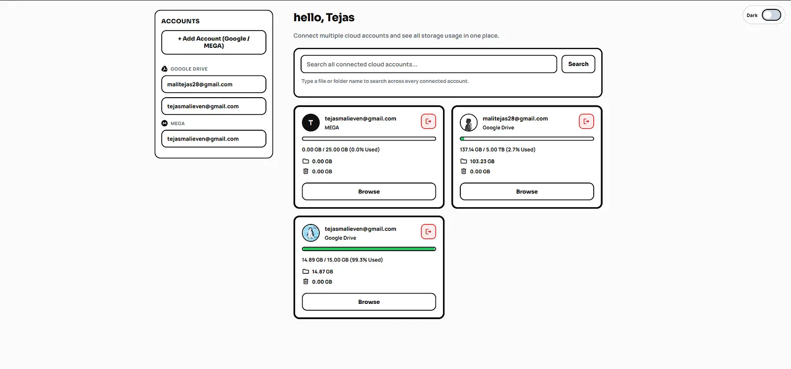

# Multi Drive

Manage multiple Google Drive and Mega accounts from a single interface with options to edit, delete, upload ,create files, and view remaining storage. and search folder from multiple account at one time.
### I build it before flavourtown that version is very basic , Thats why i decided to Build it from scratch again before flavortown ends

 

- <b>Setup Guide</b> - https://multi-drives.vercel.app/guide.html
- <b>Demo Video</b> - https://youtu.be/6LNFNvux888
 
- <b>Demo Website</b> - https://multi-drives.vercel.app/  (if you face any error try please using localhost for testing)
 
- <b>Flavortown Link</b> - https://flavortown.hackclub.com/projects/19197
 
 

 

## Important Info

- please try clearing the cache for trobleshoot if account are not showing 
- Please use localhost for unlimited usage (hosted websites can have storage limits).
- Supports Google Drive and MEGA accounts
- Browse, upload, copy/move, create folders, and search across accounts
- Storage usage is shown per connected account
- MEGA delete is currently disabled (Google Drive delete works)

## Tech Stack
- HTML
- CSS
- JavaScript
- Vercel (Hosting)
- Upstash (for storing user cache)

# Setup
- For local hosting, you only need to install npm and run `npm start` in the terminal.
- Users need to set up Google OAuth to get credentials for using Google Drive.
- Create a testing web application in Google Cloud.
- Add your website URL or localhost URL to the allowed website/redirect settings.
- Add all required accounts to the testing audience, then use those credentials to log in.
- For MEGA accounts, just enter the account email and password to log in.

